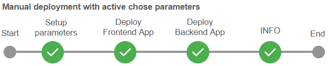
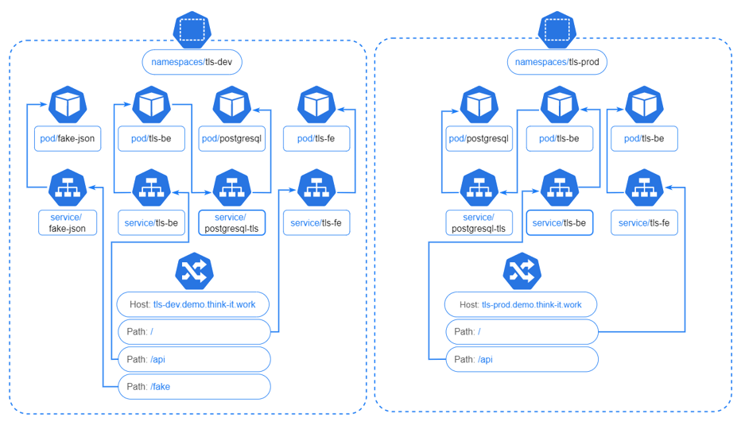

# Jenkins-CD-Pipeline

## Project propose:
> Create manual deployment with active chose parameters. Posibility to select environment, application and version;
> 
> Deploy to Kubernetis;
> 
> Deploy with helm chart;
> 
> Use one helm chart for both, frontend and backend application.

## Pipeline steps:
If parameters chosen for aplication is frontend, than we change latest tag from chart with actual latest tag. And  deploy this image with helm. 

The same thing happeneded if we choose to deploy backend.

Last step is to show us what version has been deployed on the enviroment.

## Kubernetis:
For each environment, we have specific namespaces. For each pod here is a specific service and also here we have ingress with rules. 

After deploying application in Kubernetes:

